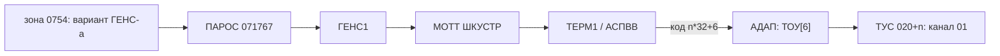

# Терминалы ЕС-7920 (АЦД) в конфигурации Диспака

Как ОС узнаёт, какие дисплеи ЕС-7920 у неё есть, и как с ними работает.
Разобрано по исходникам `~/git/re-dispsvs/src` (локальные правки) и
`~/git/besm6.github.io/sources/dispak-svs` (исходное дерево; `src/` его
перекрывает).

Строки, помеченные **[П]**, сверены по исходнику глазами; остальное собрано
чтением модулей без полнотекстового поиска по всему дереву — упоминания в
непрочитанных модулях могли остаться незамеченными (см. §6).

## Коротко

Два уровня:

1. **АДАП** (`адап.bemsh`, СТАРТ `ПВВ`) — неизменные аппаратные таблицы: 16
   мест под АЦД на канале 01, тип устройства `ТИПАЦД = 6`.
2. **Вариант ГЕНС-а** (зона 0754 системного диска) — одно слово-шкала
   `ШКУСТР` (ПАРОС 071767, слово 027 варианта): какие из 16 мест — настоящие
   дисплеи. Разряд 48−*n* = терминал *n*.

Драйверы — ТЕРМ1 (приём) и АСПВВ (выдача). Для терминала *n* они зовут АДАП с
кодом устройства *n*·32 + `ТИПАЦД`, ТОУ переводит его в ТУС 020+*n*, то есть
канал 01, устройство *n*.

Добавить дисплей = взвести разряд в слове 027 варианта (не более 16); пометить
его как ЕС-7934 — ещё и в слове 032. АДАП трогать не нужно.

## 1. Статические таблицы АДАП-а

Тип устройства (`адап.bemsh:450`):

```
ТИПАЦД ЭКВ 6
```

### ТУС / ТУСЗ

Семь блоков по 16 записей (`ККАН ЭКВ 7`, `ДТУС ЭКВ ККАН*16`,
`адап.bemsh:390-391`). Формат записи (`адап.bemsh:677-688`): разр.38-33 —
канал, разр.25 — круговой опрос, разр.22-21/19-18 — маска ПВВ, разр.17 —
селекторный канал, разр.16-07 — маска СВС (1 = недоступно).

Блок АЦД **[П]** (`адап.bemsh:703-704`):

```
*- 020 -------------------------------------------------------
 КОНД (16)М32Х’01’М24В’1’М17В’01’М16В’1’М6В’1377’     АЦД 1-20
```

ТУС 020-037 — 16 устройств на канале 0x01, селекторный разряд взведён, маска
СВС 1377. Что блок 020 — канал 0x01, видно и в живом дампе (`ПВВ.md`
§«ТУС»). Младшие 4 разряда НУС — номер устройства внутри класса.

### ТОУ

Индексируется типом. Запись АЦД **[П]** (`адап.bemsh:828`):

```
 КОНД М35В’00’М25В’00’М15В’20’В’020’   АЦД 0-F
```

Первый логический номер 0, число 020 (16), база ТУС 020. Логический АЦД *n*
→ ТУС 020+*n*. Отсюда предел — **16 дисплеев**, логические номера 0-15.

### ТЛУ

Для каждой СВС `КОНД В’0’ АЦД` (`адап.bemsh:778, 790, 802, 814`): дисплей —
общее, а не локальное устройство.

### БУДКАН (таймеры каналов)

`адап.bemsh:1222-1232`, формат: разр.38-33 — канал, 30-21 — время, 20-11 —
ожидание:

```
 КОНД М47В’0’М42В’10’М32Х’01’М20В’005’  АЦД ЕС-7920
 КОНД М47В’0’М42В’10’М32Х’02’М20В’020’  ПМ ЕС-7077
 КОНД М47В’0’М42В’10’М32Х’03’М20В’005’  АЦД ЕС-7906
```

У канала 03 (ЕС-7906) таймер есть, а блока ТУС нет — реально описан только
канал 01. Те же строки АЦД — в рабочей копии `adapcmp.b6:740, 864, 1268-1270`.

## 2. Параметры генерации: вариант ГЕНС-а

### Путь от диска до МОТТ

ВЫЗСВС читает зону 0754 (`vyzsvs.bemsh:701`):

```
КУСПАР КОНД М17В’3’М12В’02’М24В’0754’   ПАРАМЕТРЫ ГЕНС-А
```

Выбирает вариант по номеру машины (младшие 3 разряда слова 14) и номеру
варианта (тумблерный регистр 2, разр.25-28), кладёт его в `ИНФО`
(`vyzsvs.bemsh:159-183`), затем `ИНФО` → `ПАРОС` (`vyzsvs.bemsh:406-410`).
`ПАРОС` = `ГЕНС+1740` = 071740, 32 слова (`gens.bemsh:1493-1495`). Слова
терминалов (`gens.bemsh:277-285`):

```
НОМУСТ ЭКВ ’71766’ ТАБЛИЦА УСТРОЙСТВ ТТ И СОNSUL
ШКУСТР ЭКВ ’71767’
ШКОПТ  ЭКВ ’71770’
ШКСВ   ЭКВ ’71772’ ШКСВМ ДЛЯ ДИСП70 (+1 ЯЧЕЙКА ДЛЯ ТБ)
NТАС   ЭКВ ’71773’ ФИЗ. НОМЕРА ТЕРМ. АС
```

ГЕНС1 переносит их в МОТТ **[П]** (`gens1.bemsh:490-495`):

```
 СЧ Я71766
 ЗП НОМУС(М16)    НОМЕРА ТЕРМИНАЛОВ ДЛЯ ОПЕРАТОРСКИХ МАРШ.
 СЧ Я71767
 ЗП ШКУСТР(М16)   ТЕРМИНАЛЫ  ЕС-7920 И ЕС-7934
 СЧ Я71772
 ЗП ШКППМ(М16)    ТЕРМИНАЛЫ ЕС-7934
```

и дальше **[П]** (`gens1.bemsh:511-517`): `Я71770` → `ШКОПТТ`,
`ШКНОВ = ШКОПТТ | ШОТА | ШКУСТР` → `ШЗПРИМ` («НОВЫЕ ТЕРМИНАЛЫ ЗАКРЫЛИ В
ШЗПРИМ»). Эквиваленты в `gens1.bemsh:1868-1870` подтверждают: `Я71767 …
ТЕРМИНАЛЫ ЕС-7920`, `Я71772 … ТЕРМИНАЛЫ ЕС-7934`.

### Слова

| ПАРОС | слово варианта | куда | смысл |
|---|---|---|---|
| 071766 | 026 | `НОМУС` | номера терминалов для операторских маршрутов |
| 071767 | 027 | `ШКУСТР` | шкала дисплеев ЕС-7920 (и ЕС-7934) |
| 071770 | 030 | `ШКОПТТ` | операторские терминалы |
| 071772 | 032 | `ШКППМ` | шкала ЕС-7934 |

Формат шкалы: разряд 48−*n* — терминал *n* (проверяется как `Е48(М17)`).
Отдельного слова с числом терминалов **нет** — число дисплеев равно числу
взведённых разрядов. Ячейка 071772 в ГЕНС-е названа `ШКСВ`, а ГЕНС1
пользуется ею как шкалой ЕС-7934.

### Вариант по умолчанию

Если подходящего варианта нет (`СТОП 40207 … ВАРИАНТ ИЗ ВЫЗСВСС`,
`vyzsvs.bemsh:99-102`), берётся встроенный — дисплеи и операторские терминалы
0-3 **[П]** (`vyzsvs.bemsh:667-668`):

```
ШКУСТР КОНД М36В’7400’      АЦД 7906
ШКОПТТ КОНД М39В’740’       ОПЕРАТОРСКИЕ ТЕРМ.
```

### Варианты на svs2053

По `svs2053.dump`: варианты лежат в зоне дампа 0750 (сходится с комментарием
«ЧТЕНИЕ ЗОНЫ (750)» в ВЫЗСВС), 16 штук по 040 слов. Слово 016 — номер машины,
027 — `ШКУСТР`, 032 — `ШКППМ`.

| смещение варианта | машина | слово 027 | ЕС-7920 | ЕС-7934 (слово 032) |
|---|---|---|---|---|
| 0000 | 1 | `6000 0000 0000 0000` | 0, 1 | — |
| 0140, 0200 | 1 | `7077 6000 …` | 0-2, 6-13 | 10 (`0020…`) |
| 0240, 0300 | 1 | `4000 …` | 0 | — |
| 0400-0740 | 2 | те же образцы | | |

### Геометрия экрана — не параметр

Зашита в код, 24×80:

* `mott.bemsh:206` — `ДЛЭКР КОНД Ф’1840’`; `mott.bemsh:215` — `П120 КОНД В’120’`
  (80 колонок);
* `term.bemsh:31` — `НАЧПОЗ КОНД Ф’1840’ НАЧАЛО 24-ОЙ СТРОКИ`;
* `term1.bemsh:372` — `УИА -80(М5) … ЧИСЛО СИМВОЛОВ В СТРОКЕ`.

Буфер приёма — `П700` (0700 слов).

## 3. Чем ЕС-7920 отличается от терминалов МПД/АС

* **В АДАП-е** ЕС-7920 — устройство типа 6 на канале 01, через ПВВ. У линий
  МПД записи в ТУС нет вовсе: МОТТ ведёт их сам командами `РЕГ '50'-'56'`
  (см. `МПД.md`).
* **Код устройства для АДАП-а** = логический номер·32 + тип **[П]**
  (`term1.bemsh:109-112`, так же в `aspvv.bemsh:63-66`):

  ```
   СЧИ М17
   СДА 64-5
   УИ М11
   СЛИА ТИПАЦД(М11)
  ```

  Номер терминала МОТТ прямо используется как логический номер АЦД.
* **Шкалы МОТТ:**
  * `ШКУСТР КОНД В’0’ ТЕРМИНАЛЫ’НА ПРЯМОЙ’` (`mott.bemsh:1761`) — дисплеи;
  * `ШКППМ … ШКАЛА ЕС-7934` (`mott.bemsh:209`) — ЕС-7934;
  * `ШКАС` — терминалы АС/МПД;
  * `ШКВТ` (виртуальные терминалы, `term.bemsh:27`) исключаются:
    `ШКУСТР & ~ШКВТ` (`term1.bemsh:90-93`).
* **Кодировка:** `ДЛЯЭ71` берёт таблицу ЕС, если терминала нет в `ШКАС`
  (`term1.bemsh:360-367`):

  ```
   УИА ’200’(М6)  М6:= 200 - СДВИГ В ТАБКОД-Е ДЛЯ ЕС
   СЧ ШКАС / И Е48(М2) / ПО ЕС7920 / УИА 0(М6)
  ```

  На приёме `М13 := 1 - ТЕРМИНАЛ НЕ МПД` (`term1.bemsh:225`). Столбцы ЕС↔УПП
  в ТАБКОД строит ГЕНС1 (`gens1.bemsh:1765-1771`); константы ЕС (`АТСЕС`,
  `НЕДСЕС`) — `term.bemsh:4-6`.

## 4. Драйверы

| модуль, файл | роль | читает |
|---|---|---|
| ТЕРМ1, `src/term1.bemsh` | `ОПРАЦД` «ПРИЕМ С ЕС-7920» (:82-270); тестовые `ТЕСТВЫ`/`ТЕСТПР` | `ШКУСТР`, `ШКВТ`, `ШКВЫД`, `ШЗПРИМ`, `ТИПАЦД`, `ОПРТУС`, `ПВВЕС`, `БАСЕС`, `NСТР`/`КNСТР` |
| АСПВВ, `src/aspvv.bemsh` | процесс `ИВ7920` «ВЫДАЧА ЕС 7920» (:8-20, запуск через Е19); `НВ7920` выбирает `ШКУСТР & ~ШКВТ & ШКВЫД` (:87-94) | `ШКППМ` (:105-111), `ПВВЕС`, `ТИПАЦД` |
| МОТТ, `src/mott.bemsh` | хранит шкалы; процесс стартует с `ТЕРМ1.НАЧАЛО` (`ИПЗ … А(НАЧАЛО)`, :171, :222) | — |
| ТЕРМ, `src/term.bemsh` | константы (§3) | — |

Цикл приёма ТЕРМ1 **[П]** (`term1.bemsh:90-112`): шкала опроса
`ШКОПР = ШКУСТР & ~ШКВТ`; по очереди берётся старший взведённый разряд
(`НЕД` → логический номер АЦД в М17), приём пропускается, если терминал в
`ШКВЫД | ШЗПРИМ`, иначе собирается код устройства и идёт обращение к АДАП-у.

Канальные команды (в духе 3270):

* `М30Х’3’` — «ХОЛОСТОЙ ХОД» (`term1.bemsh:117`);
* чтение — `М47В’1’М44В’6’М30Х’2’М20В’700’` (`term1.bemsh:140`);
* запись — `М30В’1’` с `КПЕРЕ Х’4В1100001300’` (`mott.bemsh:210`); АСПВВ —
  `СУЗ Х’4В’`, `КПЕРЕВ Х’110000130000’`.

Клавиши внимания: `Х’7D’` — ВВОД, `Х’6D’` — СТРН ЭКР.

Лист буфера выделяет ГЕНС1: «ЗАПРОС ЛИСТА ДЛЯ АС ЧЕРЕЗ ПВВ И ЕС-7920 →
БАСЕС» (`gens1.bemsh:1164-1166`).

## 5. Как связаны таблицы АДАП-а и вариант ГЕНС-а

1. **АДАП неизменен.** ТУС 020-037, ТОУ[6] и БУДКАН описывают до 16 адресов
   на канале 01 одинаково для любой генерации. ВЫЗСВС переписывает только
   ТЛУ/РЕЗЕРВ/ТУСЗ для барабанов (`vyzsvs.bemsh:186-297`); кода, меняющего
   записи АЦД, не найдено.
2. **Вариант выбирается при загрузке:** зона 0754 → `ИНФО` → `ПАРОС`
   (071740-071777) → ГЕНС1 → МОТТ `ШКУСТР`/`ШКППМ`/`ШКОПТТ`/`НОМУС`.
3. **На ходу** ТЕРМ1 и АСПВВ обходят шкалу и для терминала *n* зовут АДАП с
   кодом *n*·32 + 6; ТОУ даёт ТУС 020+*n* — канал 01, устройство *n*.



## 6. Не найдено и чего не читали

* Приказа оператора или директивы при загрузке, настраивающей ЕС-7920
  (модули `prikaz*`, `osa` не читались).
* Записи ТУС для канала 03 (ЕС-7906) при наличии таймера в БУДКАН.
* Параметра размера экрана.
* Отдельного слова с числом терминалов.
* Письменной инструкции, как добавлять терминалы.

Читались: `адап.bemsh`, `src/{gens,gens1,vyzsvs,term,term1,mott,aspvv}.bemsh`,
`loadmap.txt`, `README.md`, `build/manifest.json`; в рабочем дереве — `ПВВ.md`,
`tools/makeSVS2053.py`, `adapcmp.b6`, `svs2053.dump`. Полнотекстового поиска
по `src/` и исходному дереву не было (оболочка не отвечала), поэтому
упоминания 7920 в других модулях не исключены.

## 7. Эмуляция: `svs_display.c`

Устройство `DISPLAY` — 16 дисплеев ЕС-7920 (юниты 0–15 = ТУС 020–037, канал
Х'01'). Пользователь работает настоящим эмулятором 3270 по tn3270:

```
attach display 4300                       ; в svs.ini, один порт на все дисплеи
c3270 -codepage cp1025 localhost:4300     ; x3270/wc3270 — так же
```

Подключение получает младший свободный дисплей. Работают только дисплеи,
включённые в вариант ГЕНС-а (`ШКУСТР`); в варианте svs2053 для машины 1 —
дисплеи 0 и 1. Повторное подключение показывает текущий экран.
`show display connections` — кто подключён; `set display codepage=cp880` —
другая кириллическая кодовая страница клиента (c3270 4.3 из Debian cp1025 не
знает, только cp880: тогда `c3270 -codepage cp880 localhost:4300`). Забой в
c3270 по умолчанию — `Erase()`, на неформатированном экране ОС он сдвигает
влево весь остаток экрана; как на ЕС-7920 (только курсор) — в `~/.c3270pro`:
`c3270.keymap: es7920` и `c3270.keymap.es7920: <Key>BACKSPACE: Left()`. Отладка —
`set display debug=OPS;TN;DATA`. Порт слушается с SO_REUSEADDR (как
`attach -U`): после перезапуска симулятора он свободен сразу, хотя соединения
прежних клиентов ещё в TIME-WAIT.

### Что делает ОС (МОТТ, АСПВВ, ТЕРМ)

| КОП | команда | массив |
|---|---|---|
| 03 | холостой ход (раз на дисплей) | — |
| 01 | запись | `WCC 4B`, знаки ДКОИ, пустые позиции 00, в конце `SBA hh ll`, `IC`; без SBA в начале — вывод с позиции курсора |
| 05 | стирание и запись (ЕС-7934) | — |
| 02 | чтение буфера | 0700 слов: AID, адрес курсора, все 1920 позиций |

* Длина массива — 6·РАЗМ + НПС байтов, по 6 байтов в слове, первый — в
  разр.48-41 (как у перфоратора ЕСПИ80).
* **Ввод опрашивается.** МОТТ по таймеру смотрит бит внимания в ТУС[020+n]
  (`ОПРТУС` → `ТЕРЕСТ`, `И Е38` после `СЧМР`; в слове эмулятора — мл16,
  разряд 0x20), гасит его и тогда выдаёт чтение буфера. Разбирает: байт 0 —
  AID, байты 1–2 — курсор, затем позиционный буфер (нули — пустые позиции).
* **AID:** 7D — ВВОД (строка ввода, курсор на следующую строку), F1–F9/7A–7C —
  ПФ1–ПФ12, 6D — стирание экрана.
* **Адреса буфера** ОС пишет «сырыми» 6+6 разрядами (`РЗБ КРЗБВ`) и читает
  младшие 6 разрядов каждого байта.
* **Состояние** ОС не проверяет: ответ всегда ДР = НУС<<2, ДРУ = 0.
* Экран 24×80, прокрутки нет: после строки 24 вывод идёт со строки 0.

### Как это устроено в эмуляторе

* **ПВВ** (`svs_iom.c`): класс `IOM_TUS_CLASS_DISP` узнаётся по каналу Х'01'
  при НУС 020–037; обмен синхронный, `svs_display_io()`.
* **tn3270** (RFC 1576, без TN3270E): переговоры TERMINAL-TYPE, EOR, BINARY
  ведёт сам модуль на «сырой» линии — `sim_tmxr` эти возможности отвергает.
  Записи кончаются `IAC EOR`, байт 0xFF удваивается.
* **Экран дисплея** хранится в модуле (ДКОИ): к нему применяется каждая
  запись ОС; по нему экран отдаётся при подключении (стирание и запись) и
  при чтении буфера без нажатой клавиши (AID 60).
* **Вывод:** запись ОС уходит клиенту командой `F1`/`F5` с тем же WCC и
  приказами; знаки перекодируются ДКОИ → кодовая страница клиента, адреса
  SBA/RA/EUA — из 6+6 разрядов в стандартную 12-разрядную форму.
* **Ввод:** по AID клиента (ВВОД, ПФ) модуль сам посылает клиенту `F2`
  (чтение буфера) и получает все 1920 позиций с нулями: ОС разбирает
  позиционный буфер, и нули в нём нужны на своих местах. Затем взводит бит
  внимания; чтение ОС получает AID, курсор и этот буфер. Стирание экрана и
  PA — без обращения к клиенту.
* **Кодовые страницы:** `svs_display_cp.h`, строит `tools/mkdispcp.py` из
  таблицы ДКОИ принтера (`svs_printer.c`) и `iconv` (IBM1025, IBM880).
  Латинские буквы, совпадающие по начертанию с русскими, и строчные сводятся
  к кодам ДКОИ. ДКОИ 5B и 5F — `$` и `~` (в печати тоже). Знака ¦ (6A) в
  IBM1025 нет, он показывается сплошной чертой `|`. В IBM880 нет `|` и `~` —
  они показываются пробелом. После `tools/mkdispcp.py` модуль надо
  пересобрать принудительно (`touch svs_display.c`): зависимости от
  `svs_display_cp.h` в makefile нет.

### Проверено

Скриптовым клиентом tn3270 (IBM-3278-2, IBM1025): переговоры; начальный экран;
`СВОДКА 4199` + ВВОД на дисплее 0 — ОС читает буфер, запускает Ф002 и пишет
ответ на тот же дисплей («СВОДКА ПО ТОМУ 2052,ТЕРМИНАЛ СВОБОДЕН»); второй
клиент одновременно работает на дисплее 1; повторное подключение к дисплею 0
показывает прежний экран.

### Не сделано

* TN3270E, чтение модифицированных полей по команде ОС (ОС его не выдаёт),
  Sense, состояние «не готов».
* ЕС-7934 (печать на том же контроллере, шкала `ШКППМ`) обслуживается как
  дисплей: стирание и запись показываются на экране клиента.
* Собирательный бит внимания `ТУСКОЛ` (прерывание процессору) не взводится:
  МОТТ опрашивает ТУС сам.
